<!-- ═══════════════════════════════════════════════════════════════ -->
<!--                         OMAR REHAB                             -->
<!-- ═══════════════════════════════════════════════════════════════ -->

 

  

 

 

  

 

 

## 👨‍💻 About Me

I'm Omar Rehab, a Software Engineering Student and Full-Stack Developer passionate about building modern, scalable, and user-focused web applications.

I enjoy working across both backend and frontend technologies, designing APIs, building reliable systems, and turning ideas into complete web applications.

- 🎓 Software Engineering Student
- 💻 Full-Stack Developer
- ⚙️ Backend Development
- 🌐 Web Application Development
- 🚀 Always learning and building new projects

 

 

## 🛠️ Languages & Technologies

  
    

  
  
  
  

    

  
    

  
  
  

    

  
    

  
  
  
  

 

 

## 🚀 What I Build

| Area | Focus |
|---|---|
| 🔧 Backend | APIs, server-side applications & business logic |
| 🌐 Full-Stack | Complete modern web applications |
| 🗄️ Databases | Data modeling, queries & application integration |
| 🔐 Authentication | Secure user authentication & authorization |
| ⚡ APIs | RESTful APIs & backend services |
| 🎨 Frontend | Responsive and interactive web interfaces |

 

 

## 🌐 Top Languages

  

 

 

## 📌 Featured Projects

I'm continuously working on projects that help me improve my development skills and gain practical experience.

Some of the areas I work on include:

- Full-Stack Web Applications
- Backend APIs
- Authentication Systems
- Database-driven Applications
- Business & Management Systems
- Modern Responsive Websites

 

 

## 📈 GitHub Activity

  

 

  

 

 

## 🤝 Let's Connect

  

  

 

  <b>Building. Learning. Improving. 🚀</b>

 

<!-- ═══════════════════════════════════════════════════════════════ -->
<!--                  Profile automatically updated                 -->
<!-- ═══════════════════════════════════════════════════════════════ -->
